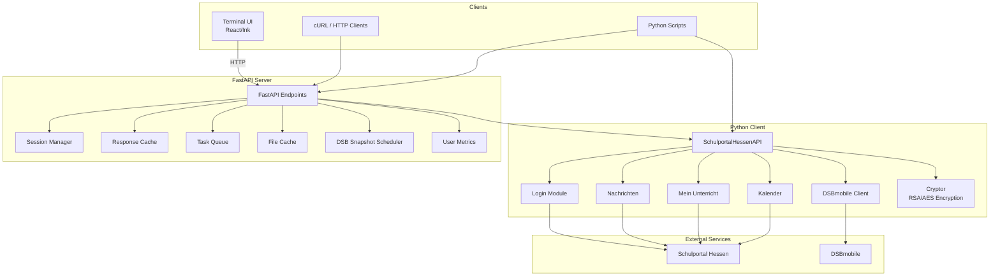
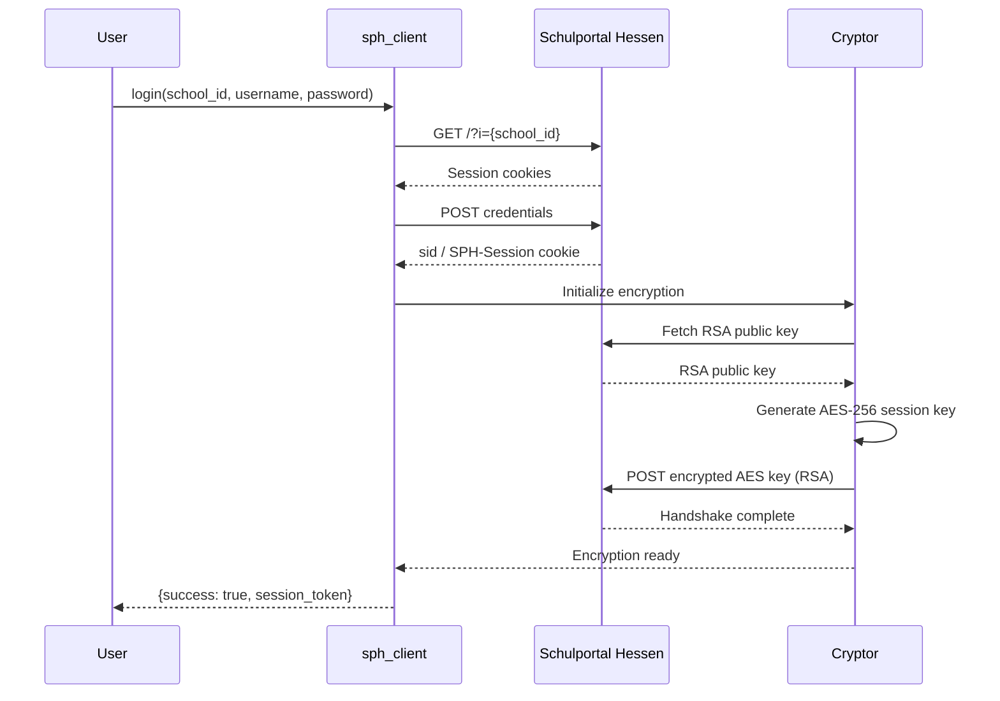
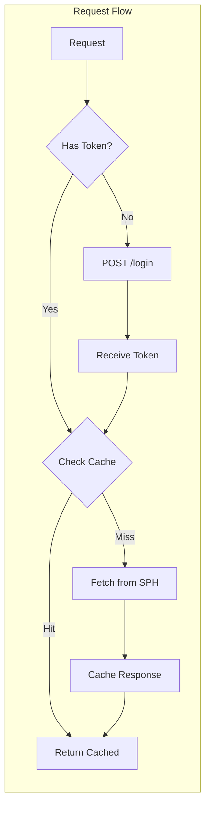

# Unofficial LANiS (Schulportal Hessen) API

[](https://www.python.org)
[](LICENSE)
[](https://pypi.org/project/sph-client/)

An unofficial Python API client, FastAPI server, and terminal UI for **Schulportal Hessen (LANiS)** — the digital school platform used by schools in Hesse, Germany. This project reverse-engineers the portal's web interface to provide a programmatic REST API and developer-friendly tooling.

> **Disclaimer:** This project is unofficial and not affiliated with Schulportal Hessen or the Hessische Lehrkräfteakademie.

## AI Declaration

Heavy AI assistance, but no vibe coding. Every line is reviewed and understood before merge. I call it **agentic coding**: the AI drafts, I direct and approve. Review history in the [LANiS UI PRs](https://github.com/joan-code6/lanis_ui/pulls).

---

## Architecture Overview



---

## Components

This monorepo contains four main components:

| Component | Description | Language |
|-----------|-------------|----------|
| **`sph_client` / `schulportal_hessen`** | Core Python client library | Python 3.10+ |
| **`api/`** | FastAPI REST server wrapping the client | Python 3.10+ |
| **`tui/`** | Terminal-based UI for the API | TypeScript/React (Ink) |
| **`scripts/`** | DSB substitution plan tools | Python |

---

## Authentication Flow



---

## Features

- **Full portal access** — apps, profile, calendar, messages, courses, timetable, file storage, school directory
- **Hybrid RSA/AES encryption** — transparently handles SPH's message encryption
- **DSBmobile integration** — substitution plan fetching and parsing
- **FastAPI REST API** — thread-safe multi-user sessions with token auth
- **Response caching** — 10-min TTL (30-day for static data) with stale-while-revalidate
- **File caching** — SHA-256 deduplicated download cache for course attachments
- **Terminal UI** — full-featured TUI built with React/Ink
- **Background task queue** — priority-based async processing for message sync, file downloads, and metrics
- **Daily DSB snapshots** — automated substitution plan archiving

---

## Installation

### Python Client & API Server

```bash
# Install from source
git clone https://github.com/joan-code6/lanis_api.git
cd lanis_api
pip install -e .

# With dev dependencies (pytest, ruff)
pip install -e .[dev]
```

### Terminal UI (Node.js)

```bash
cd tui
npm install
npm run dev
```

---

## Quick Start

### Using the Python Client

```python
from sph_client import SchulportalHessenAPI

api = SchulportalHessenAPI()

# Login
result = api.login("1234", "username", "password")
if result.get("success"):
    # Get available modules
    modules = api.get_available_modules()
    print(modules)

    # Fetch messages
    headers = api.nachrichten_get_headers()
    print(headers)

    # Get calendar events
    events = api.kalender_get_events()
    print(events)

    api.logout()

api.close()
```

### Running the FastAPI Server

```bash
uvicorn api.api:app --reload
```

The API is available at `http://localhost:8000` with interactive docs at `/docs`.

### Using the Terminal UI

```bash
cd tui
npm run dev
```

Follow the prompts to enter your school ID, username, and password.

---

## API Endpoints

### Authentication

| Method | Endpoint | Auth | Description |
|--------|----------|------|-------------|
| `POST` | `/login` | — | Login with `school_id`, `username`, `password` |
| `POST` | `/logout` | Token | End session and clear cache |

### System

| Method | Endpoint | Auth | Description |
|--------|----------|------|-------------|
| `GET` | `/health` | — | Health check |
| `GET` | `/metrics/stats` | — | Anonymous usage metrics |

### Modules & Apps

| Method | Endpoint | Auth | Description |
|--------|----------|------|-------------|
| `GET` | `/apps` | Token | Raw app list (30-day cache) |
| `GET` | `/modules` | Token | Normalized module list (30-day cache) |

### Messages (Nachrichten)

| Method | Endpoint | Auth | Description |
|--------|----------|------|-------------|
| `GET` | `/nachrichten/headers` | Token | Conversation list |
| `GET` | `/nachrichten/{id}` | Token | Conversation thread |
| `GET` | `/nachrichten/search` | Token | Search recipients |
| `POST` | `/nachrichten/send` | Token | Send new message |
| `POST` | `/nachrichten/reply` | Token | Reply to conversation |
| `POST` | `/nachrichten/mark-read` | Token | Mark as read |

### Courses (Mein Unterricht)

| Method | Endpoint | Auth | Description |
|--------|----------|------|-------------|
| `GET` | `/meinunterricht` | Token | Recent course entries |
| `GET` | `/meinunterricht/course/{id}` | Token | Detailed course view |
| `GET` | `/meinunterricht/entry` | Token | Entry details by URL |
| `GET` | `/meinunterricht/weekly` | Token | Weekly overview |
| `GET` | `/meinunterricht/submissions` | Token | Assignments/submissions |
| `POST` | `/meinunterricht/homework-done` | Token | Toggle homework status |
| `GET` | `/meinunterricht/file/{hash}` | Token* | Download cached file |

### Calendar (Kalender)

| Method | Endpoint | Auth | Description |
|--------|----------|------|-------------|
| `GET` | `/kalender` | Token | Calendar metadata |
| `GET` | `/kalender/events` | Token | Events with filters |
| `GET` | `/kalender/event/{id}` | Token | Single event details |

### Plans

| Method | Endpoint | Auth | Description |
|--------|----------|------|-------------|
| `GET` | `/vertretungsplan` | Token | Substitution plan |
| `GET` | `/stundenplan` | Token | Timetable |

### File Storage (Dateispeicher)

| Method | Endpoint | Auth | Description |
|--------|----------|------|-------------|
| `GET` | `/dateispeicher` | Token | Folder contents |
| `GET` | `/dateispeicher/search` | Token | Search files |

### Study Groups (Lerngruppen)

| Method | Endpoint | Auth | Description |
|--------|----------|------|-------------|
| `GET` | `/lerngruppen` | Token | Study groups overview |

### User Profile

| Method | Endpoint | Auth | Description |
|--------|----------|------|-------------|
| `GET` | `/benutzer` | Token | Profile data (30-day cache) |

### School Directory

| Method | Endpoint | Auth | Description |
|--------|----------|------|-------------|
| `GET` | `/school-list` | — | All schools by district |
| `GET` | `/school-list/district/{id}` | — | Schools in district |
| `GET` | `/school-list/search` | — | Search schools by name |

### DSBmobile (Substitution Plans)

| Method | Endpoint | Auth | Description |
|--------|----------|------|-------------|
| `POST` | `/dsb/login` | Token | Login to DSBmobile |
| `POST` | `/dsb/plan-urls` | Token | Get plan iframe URLs |
| `POST` | `/dsb/plan` | Token | Fetch & parse plan |

### Documentation

| Method | Endpoint | Auth | Description |
|--------|----------|------|-------------|
| `GET` | `/documentation` | — | Auto-generated API docs |
| `GET` | `/documentation/{path}` | — | Single endpoint docs |

---

## Session & Caching



- **Session TTL:** 1 hour inactivity timeout per session
- **Response cache:** 10 minutes for most endpoints
- **Long cache (30 days):** `/modules`, `/apps`, `/benutzer`
- **School list cache:** 2 days with 3-day auto-refresh
- **File cache:** SHA-256 hashed, stored in `data/files/`
- **Background revalidation:** stale entries are refreshed asynchronously

---

## Environment Variables

| Variable | Used By | Default | Description |
|----------|---------|---------|-------------|
| `PUBLIC_BASE_URL` | API | `http://localhost:8000` | Public URL for file downloads |
| `LANIS_API_SCHOOL_ID` | Client | — | School ID |
| `LANIS_API_USERNAME` | Client | — | SPH username |
| `LANIS_API_PASSWORD` | Client | — | SPH password |
| `DSB_USERNAME` | API | — | DSBmobile username |
| `DSB_PASSWORD` | API | — | DSBmobile password |
| `DSB_SCHOOL_ID` | API | — | DSB school ID |
| `API_URL` | TUI | `https://lanis-backend.arg-server.de:8000` | Backend URL |

---

## Project Structure

```
lanis_api/
├── api/                      # FastAPI server
│   ├── api.py               # Main app & endpoints
│   ├── file_cache.py        # Course file download cache
│   ├── dsb_snapshot.py      # Daily DSB plan archiver
│   ├── documentation/       # Auto-generated API docs
│   ├── metrics/             # User metrics (SQLite)
│   └── queue/               # Background task queue
├── schulportal_hessen/      # Core Python client
│   ├── base.py              # Base API class
│   ├── applets/             # Feature modules
│   │   ├── login/           # Authentication
│   │   ├── nachrichten/     # Messaging
│   │   ├── mein_unterricht/ # Courses
│   │   ├── kalender/        # Calendar
│   │   ├── vertretungsplan/ # Substitution plans
│   │   ├── stundenplan/     # Timetable
│   │   ├── dateispeicher/   # File storage
│   │   ├── lerngruppen/     # Study groups
│   │   ├── benutzer/        # User profile
│   │   └── school_list/     # School directory
│   ├── external/dsb/        # DSBmobile client
│   └── tools/cryptor.py     # RSA/AES encryption
├── sph_client/              # Public package re-exports
├── tui/                     # Terminal UI (React/Ink)
│   ├── src/
│   │   ├── cli.tsx          # Entry point
│   │   ├── api.ts           # API client
│   │   └── screens/         # UI screens
│   └── lanis.js             # CLI binary
├── scripts/                 # Helper scripts
│   └── dsb_tracking/        # Substitution plan tracker
├── docs/                    # Generated docs
├── api-tests.py             # Integration tests
├── pyproject.toml            # Package config
└── deploy.sh                # Deployment script
```

---

## Testing

Integration tests require a running API server and credentials:

```bash
export LANIS_API_URL=http://localhost:8000
export LANIS_API_SCHOOL_ID=1234
export LANIS_API_USERNAME=your_username
export LANIS_API_PASSWORD=your_password

pytest api-tests.py
```

---

## Deployment

A systemd service file is provided at `lanis-api.service`:

```bash
# Deploy using the provided script
./deploy.sh

# Or manually with systemd
sudo cp lanis-api.service /etc/systemd/system/
sudo systemctl enable lanis-api
sudo systemctl start lanis-api
```

---

## License

MIT
